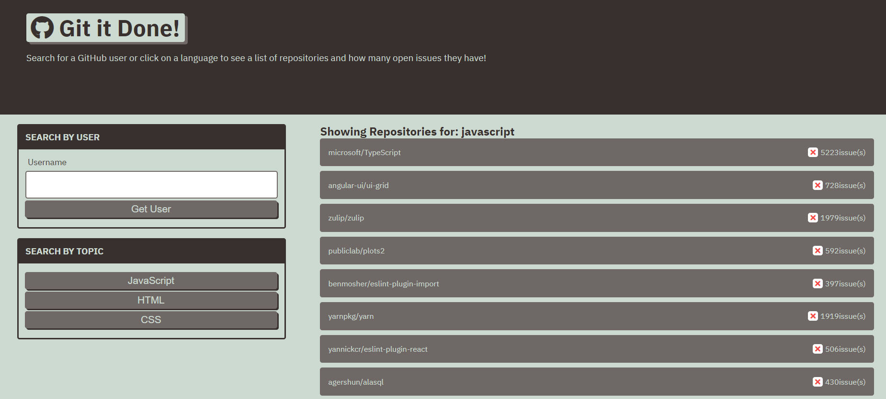

# git-it-done

A web application that searches GitHub for open source projects with open issues and pull requests. In this application, you can search GitHub repositories by either username or by three languages (Javascript, HTML, CSS). You can also click on each repository and view its open issues and pull requests.

## Task List

- [x] Dynamically change HTML and CSS using JavaScript.
- [x] Use the browser's Fetch API to communicate with the server.
- [x] Collect user inputs to form HTTP requests.
- [x] Use an HTTP request's response to display data to the user.
- [x] Pass information from one page to another using query parameters.
- [x] Make the API calls dynamic by using the query parameter to alter the request.
- [x] Implement event delegation when clicking buttons.
- [x] Add query string parameters to the GitHub API’s URLs.

## Tech/framework used

* HTML
* CSS
* JavaScript

## User Story

As a programmer, I would like to see a list of open-source projects for a specific language or by a specific user along with their open issues and pull requests, so I can contribute to them.

## Acceptance Criteria

* Add ability to search GitHub repositories by username.
* Add "X" with the number of issues or pull requests to repositories with open issues.
* Add ability to click on a repository name, and view list of all open issues for that repository.
* Add ability to search GitHub repositories by specific languages.

## Link to Deployed Application

https://sshahram.github.io/git-it-done/

## Link to GitHub Repository

https://github.com/sshahram/git-it-done

## Screenshot

Here is the snapshot of the website:

